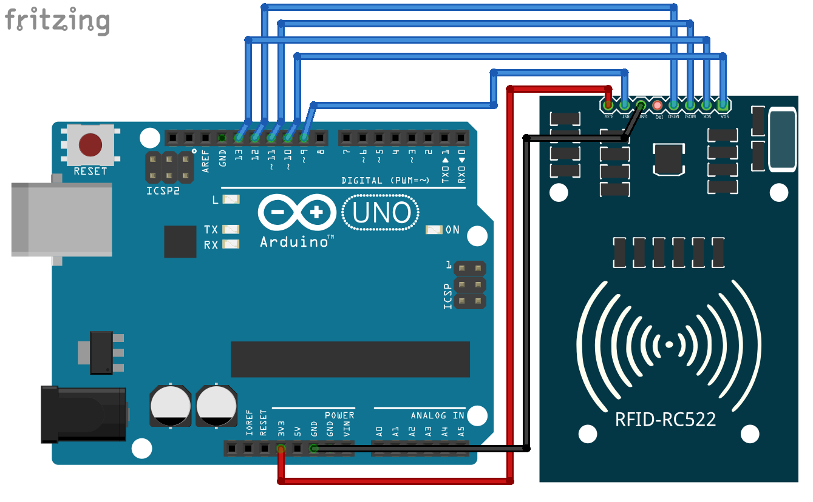

# RFID-based Library Inventory Management System


## Table of Contents
- [Description](#description)
- [Features](#features)
- [Tech Stack](#tech-stack)
- [Installation](#installation)
- [Tag Scanner](#tag-scanner)


## Description
The RFID-based library inventory management system automates various routines of any library by integrating the RFID technology to efficiently check-in, or check-out books. It helps to track and manage the inventory of the library alongwith providing the faility to check how many books are issued currently and what time period are they issued.


## Features
- **Add Books:** Allows the admin to add information about new books into the database.

- **Remove Book:** Allows the admin to remove data about books that have been lost, misplaced, or simply have conditioned over time.

- **Modify Book Data:** Allows the admin to modify existing book data such as title of the book, author, genre, etc. Helps to correct any mistakes that can happen at the time of book addition.

- **Issue/Return Book:** Allows the admin to keep track of books that have been issued at present. This helps the library to fine or request overdue books.


## Tech Stack
- **Frontend:** HTML, CSS, JS
- **Backend:** Python (*Flask*)
- **Database:** MySQL
- **Version Control:** Git, GitHub


## Installation
Follow these steps to set up the project locally:

### Prerequisites:
1. **Python Support:** Ensure you have a configurable environment capable of executing Python.

2. **Libraries:** The following libraries are necessary for hosting the project locally:    
    - *Flask*: Python micro web framework for web-app's design & logic.
    - *Serial*: For serial communication with the scanner device.
    - *MySQL Connector*: To execute queries into the book database.

3. **MySQL Server:** Make sure you have a MySQL server installed on the machine intended for local setup.

### Setup:
1. **Clone the repository:**

   ```bash
   git clone https://github.com/RadiantQuark/RFID-Library.git
   ```
  
2.  **Install required Python Libraries:**  
    Install the required python libraries by executing the following commands:

     ```bash
    pip install Flask
    pip install serial
    pip install mysql-connector-python
    ```

3. **Start Database Server:**  
    Start the MySQL service. Make sure the service starts on the port *3306*.

4. **Import the Database:**  
    From your database service control panel, import the pre-constructed database schema into the local database server by importing the file *database_structure.sql* from the root directory of the repository.

5. **Start the webserver:**  
    Navigate to the repository root and execute:
     ```bash
   python app.py
   ```
   Flask will start serving files on *http://localhost:5000* by default.  


# Tag Scanner

### Schematic:
  

### Connections: 
| MFRC522 | Arduino Uno |
| :-----: | :---------: |
|  3.3V   |     3.3V    |
|   GND   |      GND    |
|   RST   |    PIN 9    |
|   SDA   |    PIN 10   |
|  MOSI   |    PIN 11   |
|  MISO   |    PIN 12   |
|   SCL   |    PIN 13   |

### Program:
The arduino program used to read UID of scanned tags can be found in the [*Read_UID.ino*](./Read_UID.ino) file. Note that changing the *baud rate* from the default value of *9600* can break the web-app. Necessary changes should be done to [*app.py*](./app.py) file to accomodate the changing of baud rate.
